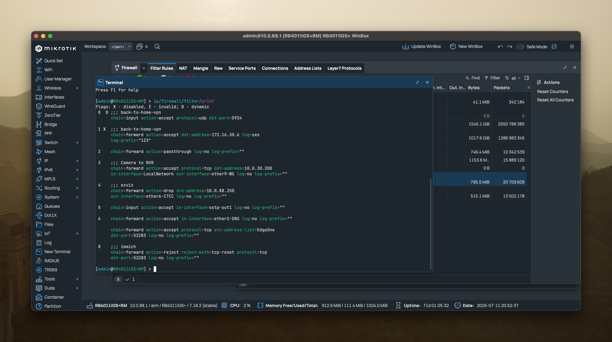

+++
date = '2025-07-11T19:43:25+08:00'
draft = false
title = 'Next-Terminal: A Secure Access Solution for Home Networks'
description = 'Exploring how to use Next-Terminal to build a secure access solution for home networks and mitigate public exposure risks'
+++

# A New Secure Access Approach for Home Networks: Next-Terminal in Practice

With the rapid spread of information technology, more and more home users are building their own servers, mini NAS systems, and home automation centers. At the same time, how to **securely, efficiently, and cost-effectively** access these devices from the public internet has become an urgent issue to solve.

The open-source project [Next-Terminal](https://github.com/dushixiang/next-terminal) (abbreviated as NT) offers an elegant solution for home users. It’s not only open-source and free, but also extremely lightweight (only around 200MB) and highly performant. It can be easily deployed on public nodes such as Alibaba Cloud, Tencent Cloud, or other lightweight cloud instances, serving as the single entry point for all traffic. NT securely forwards requests to various services in the home network, achieving **unified management of secure proxy and access control**.

---

## 1. Security Risks of Exposing Home Networks to the Internet

### 1.1 Common Ways of Home Network Exposure

Suppose you’ve set up a website or NAS device at home and want to access it remotely. Common approaches include:

- **Port forwarding on the home router** (using a public IP);
- Domain name resolution to a dynamic home IP (Dynamic DNS);
- Direct connection using IPv6 address.

### 1.2 Potential Security Risks from Public Exposure

Regardless of whether you use DDNS or IPv6, exposing your device to the public internet means:

- A significantly increased chance of being scanned by attackers;
- Anyone who knows your IP can try to connect;
- If there are any vulnerabilities (e.g., outdated NAS, PHP flaws), attackers might compromise your internal network.

In IPv4, NAT allows many internal devices to access the internet using one public IP. However, with IPv6, **each device can have its own public IP**, which facilitates direct communication but introduces new threats:

- Predictable addresses — attackers can guess address ranges based on a known /60 prefix;
- Every device at home (router, NAS, cameras, smart TVs) has its own IPv6 address;
- Knowing one server address could allow inference of the entire network prefix;
- Despite the vast IPv6 space, **targeted scans and brute force attacks are still feasible**;
- Many home devices lack strict IPv6 firewall configurations, meaning open ports might be directly accessible.

> **Security Alert**: The global reachability of IPv6 makes home devices more vulnerable to targeting and attacks.

---

## 2. How Does Next-Terminal Help Solve These Problems?

Next-Terminal uses a "unified entry proxy + fine-grained access control" approach with key features such as:

- **No exposure of internal ports to the public internet**;
- **Ports open only to trusted entry points**;
- **Supports fine-grained access control and login authentication**;
- **Auditable, manageable, and authorizable access to your services**.

```mermaid
graph LR
    A[User] --> B[NT Public Node]
    B --> C[Home Gateway]
    C --> D[Internal Services]
````

### Scenario: Securely Exposing a Home Website to the Internet

Suppose you have a website at `http://192.168.1.100:8080` on your home network and want to access it from outside — but don’t want anyone to be able to connect directly.

**Traditional method**: Port forwarding — risky  
**Improved method**: Use NT for **reverse proxy + authentication**

### Steps (With Public IP):

1. Deploy Next-Terminal on a public server (e.g., Alibaba Cloud);
2. Configure your home firewall to **only allow the public server’s IP to access relevant ports**;
3. Add internal assets (like your home website) and configure port mapping;
4. Enable authentication and authorization (multi-factor authentication, passkeys, etc.);
5. External users access via NT’s web interface — requests are proxied to your internal service after verification.

### Steps (Without Public IP):

1. Deploy Next-Terminal on a public server;
2. Deploy NT secure gateway in your home (e.g., container or mini host);
3. Register the NT gateway with the NT platform;
4. Add internal assets to be accessed;
5. Enable authentication and authorization;
6. External users access through NT — the public server proxies requests to the NT gateway, which forwards to internal services.


---

## 3. Firewall Strategy: Trust Only the Public Server, Reject Everything Else

To further enhance security, configure firewall rules on your home router or soft router:

- **Only allow the NT public server’s IP** (e.g., Alibaba Cloud) to access specific ports (like NAS port 8080);
- **Block all other IPs from accessing these ports**.

This ensures "**only trusted servers can access your home network**", preventing connections even if your public IP is known.

```bash
# Example firewall rule (assuming home gateway uses iptables)
# Allow access from Alibaba Cloud IP to port 8080
iptables -A INPUT -p tcp -s <NT_Public_IP> --dport 8080 -j ACCEPT
# Drop access from all other IPs to port 8080
iptables -A INPUT -p tcp --dport 8080 -j DROP
```



---

## 4. Comparison with Traditional VPN and FRP Solutions

|Feature|VPN|FRP|NextTerminal ✅|
|---|---|---|---|
|Security|High (requires hardware)|Medium (requires setup)|High (granular control)|
|Usability|Requires client|Complex config|Web-based access|
|Deployment Difficulty|Easy (hardware)|Moderate|Easy (container deployment)|
|User Access Control|✅ Supported|❌ Not supported|✅ Supported|
|Logging & Audit|Hard to query|❌ Not supported|✅ Supported|
|Internal Service Proxy|✅ Auto config|Manual port mapping|✅ Auto proxy|

---

## 5. Extended Use Cases: More Than Just Website Access

NextTerminal can proxy not only websites, but also:

- Remote SSH access to home Linux machines;
- RDP access to Windows desktops;
- NAS directory browsing (e.g., via WebDAV);
- Access to camera admin panels;
- Connect to HomeAssistant, Aria2, Transmission, and other home services.

All with a unified entry point and unified identity authentication.

---

## A Note to Developers: Don’t Let Open Source Go Unnoticed

Next-Terminal is a free, open-source secure ops platform developed by a Chinese developer and maintained actively on GitHub. Whether you're a developer, ops engineer, or home user, it's strongly recommended to:

- Try deploying and using the platform yourself;
- Give the project a ⭐️ Star;
- Share it in your blog or community;
- Suggest features or contribute docs to help improve it!

---

## 📘 References and Recommended Links

- Project: [https://github.com/dushixiang/next-terminal](https://github.com/dushixiang/next-terminal)
- Docs: [https://next-terminal.dushixiang.com](https://next-terminal.dushixiang.com/)
- IPv6 Security (Google Research Paper): [https://research.google/pubs/pub46246/](https://research.google/pubs/pub46246/)
- Home Security Setup Guide (Zhihu): [https://zhuanlan.zhihu.com/p/620203743](https://zhuanlan.zhihu.com/p/620203743)

---

## Conclusion

Next-Terminal is not just a great enterprise remote ops platform — it’s also **perfect for home users**. By building a unified and secure access point, you no longer have to worry about public internet attacks, deal with complex VPN setups, or risk exposing your internal network.

> The security of home IT infrastructure is something every tech enthusiast should care about. Start today by deploying Next-Terminal and level up your network security.