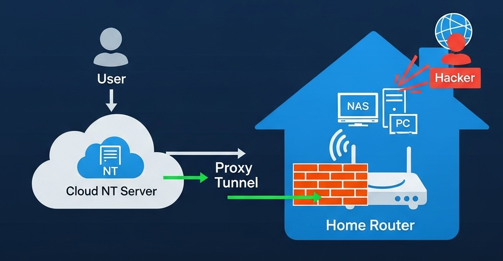

+++
date = '2025-07-11T19:43:25+08:00'
draft = false
title = 'Next-Terminal：家庭内网安全访问解决方案'
description = '探讨如何利用Next-Terminal构建安全的家庭内网访问方案，解决公网暴露风险问题'
+++

# 家庭内网安全访问新方案：Next-Terminal的技术实践与应用

在信息技术快速普及的今天，越来越多的家庭用户搭建起属于自己的服务器、小型 NAS 系统、家庭自动化控制中心等内部 IT 架构。与此同时，如何**安全、高效、低成本**地从公网访问这些设备，成为一个亟需解决的问题。

开源项目 [Next-Terminal](https://github.com/dushixiang/next-terminal)（简称 NT）为家庭用户提供了一个优雅的解决方案。它不仅开源、免费，而且资源占用极低（仅约 200MB），性能极高，可以轻松部署在阿里云、腾讯云、轻量云等公网节点上，承担所有流量入口，并将请求安全地转发至家庭内网中的各种服务，真正实现了**安全代理与权限控制统一入口管理**。

---

## 一、家庭网络公网暴露的安全隐患分析

### 1.1 常见家庭网络暴露方式
假设你在家中部署了一个网站或者 NAS 设备，并希望在外网访问，常见的做法是：

- **光猫直接进行端口映射**（公网 IP）；
- 直接域名解析至家庭公网 IP（动态 DNS）；
- 使用 IPv6 地址直连

### 1.2 潜在安全风险，公网攻击风险高

无论你使用动态域名 + DDNS 还是公网 IPv6 地址，只要设备暴露在公网，就意味着：

- 被黑客扫描的几率大幅增加；
- 任何人只要知道你的 IP 地址就能尝试连接；
- 一旦服务有漏洞（如老旧 NAS、PHP 漏洞），攻击者可能直接入侵内网。

在 IPv4 中，我们普遍使用 NAT（地址转换）将多个内网设备通过一个公网地址上网。但在 IPv6 中，**每个设备都可以拥有公网地址**，虽然这有助于直连通信，却也带来新的隐患，例如：

- 地址可预测性，攻击者可通过已知地址推测整个/60前缀范围；
- 家中每台设备（如路由器、NAS、摄像头、智能电视）都有自己的 IPv6 地址；
- 攻击者只需知道你服务器的一个 IPv6 地址，即可推测出整个网络前缀范围；
- 由于 IPv6 地址空间虽大，但仍可**进行特定范围段的端口扫描与暴力测试**；
- 很多家庭设备的防火墙并未对 IPv6 有严格配置，一旦开放了某个端口，可能直接被访问。

> **安全警示**：IPv6的全球可达性特性使家庭设备更容易被定位和攻击。

---

## 二、Next-Terminal 如何帮你解决以上问题？

Next-Terminal 采用“统一入口代理+精细化权限控制”机制，主要特点包括：

- **不再暴露内部端口到公网**；
- **只对可信入口开放端口**；
- **支持细粒度访问控制与登录认证**；
- **可审计、可管理、可授权访问你的服务**。


### 场景模拟：将家庭内网网站安全暴露给公网

假设你家中部署了一个网站（如 `http://192.168.1.100:8080`），你想在外面访问它，但又不希望任何人都能直接连接。

传统做法：直接端口映射到公网，问题在于安全性欠考量  
改进做法：使用 NT 的**反向代理+权限验证**

### 实施步骤（有公网地址）：

1. 在公网服务器（如阿里云）上部署 Next-Terminal；
2. 在路由器防火墙中**仅允许公网服务器的 IP（如阿里云 IP）访问端口**；
3. 添加需要访问的资产（如内网网站）并添加端口映射；
4. 启用认证、授权功能，包括多因素认证以及 Passkey 等；
5. 外部用户通过 Next-Terminal 平台访问，身份校验后由公网服务器代理请求至内部目标服务。

### 实施步骤（无公网地址）：

1. 在公网服务器（如阿里云）上部署 Next-Terminal；
2. 在家庭路由器中部署 NT 安全网关（轻量容器或小型主机）；
3. 将 NT 网关注册至 NT 平台；
4. 添加需要访问的资产（如内网网站）；
5. 启用认证、授权功能，包括多因素认证以及 Passkey 等；
6. 外部用户通过 NT 平台访问，身份校验后由公网服务器代理请求至家庭网关，再转发至目标服务。



---

## 三、防火墙策略：只信任公网服务器，拒绝一切其它访问

为了进一步提升安全性，你可以在家中路由器或软路由中设置如下防火墙规则：

- **只允许 NT 公网服务器 IP**（如阿里云节点）访问指定端口（如 NAS 的 8080）；
- **阻断其他任何来源 IP 的访问请求**。

这种方式实现了“**只有我信任的服务器能访问我的家庭内网**”，哪怕有人得到了你的公网 IP 地址，也无法连接设备。

```bash
# 示例防火墙策略（假设家庭网关使用 iptables）
# 允许阿里云IP访问8080
iptables -A INPUT -p tcp -s <NT公网IP> --dport 8080 -j ACCEPT
# 拒绝其它IP访问8080
iptables -A INPUT -p tcp --dport 8080 -j DROP
```


---

## 四、与传统 VPN、FRP 方案对比

|特性|VPN|FRP|NextTerminal ✅|
|---|---|---|---|
|安全性|高（需硬件）|中等（需配置）|高（精细授权）|
|易用性|外部访问需客户端|配置复杂|网页访问即可|
|部署难度|简单（硬件）|中|简单（容器部署）|
|用户权限管理|✅ 支持|不支持|✅ 支持|
|日志与审计|不便查询|不支持|✅ 支持|
|内网服务代理能力|✅ 自动配置|需端口映射|✅ 自动代理|

---

## 五、延伸用途：不仅仅是访问网站

NextTerminal 不仅能代理网站，还能用于：

- 远程控制家庭 Linux 主机（SSH）；
- 管理内网 Windows 桌面（RDP）；
- 查看 NAS 文件目录（甚至WebDAV）；
- 访问摄像头管理后台；
- 接入 HomeAssistant、Aria2、Transmission 等家庭服务。

并且一切操作都有统一入口、统一身份认证。

---

## 致开发者：开源精神不应被辜负

Next-Terminal 是一款由国人开发、免费开源的安全运维平台，代码托管于 GitHub，开发者持续维护更新。如果你是开发者、运维人员或家庭用户，强烈建议：

- 亲自体验这款软件的部署流程与使用方式；
- 给项目一个 Star ⭐️；
- 在你的博客或社群宣传它；
- 提出建议或贡献文档，一起完善它！

---

## 📘 参考资料与推荐链接

- 项目地址：[https://github.com/dushixiang/next-terminal](https://github.com/dushixiang/next-terminal)
- 文档中心：[https://next-terminal.dushixiang.com](https://next-terminal.dushixiang.com/)
- IPv6 安全性讨论（Google security paper）：[https://research.google/pubs/pub46246/](https://research.google/pubs/pub46246/)
- 家庭用户安全配置建议（知乎）：[https://zhuanlan.zhihu.com/p/620203743](https://zhuanlan.zhihu.com/p/620203743)

---

## 结语

Next-Terminal 不仅是一款优秀的企业级远程运维平台，它也**非常适合家庭用户**使用。通过构建统一、安全的访问入口，我们不再需要担心公网攻击、不再依赖繁琐的 VPN 配置，也不需要冒着暴露内网的风险。

> 家庭 IT 架构的安全，是每一个技术爱好者应当重视的课题。今天，从部署一个 Next-Terminal 开始，提升你的网络安全水平吧。
